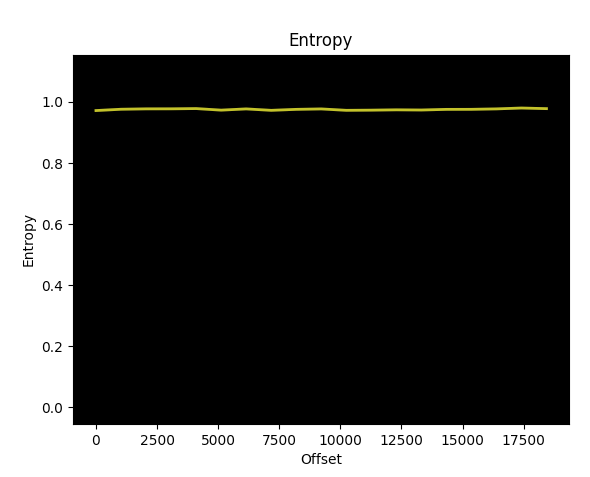
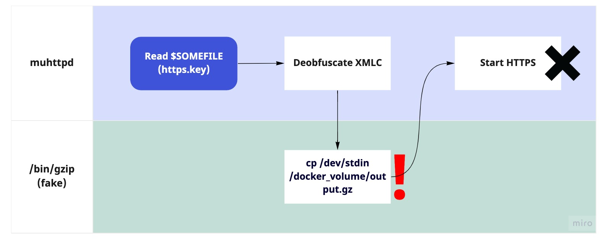
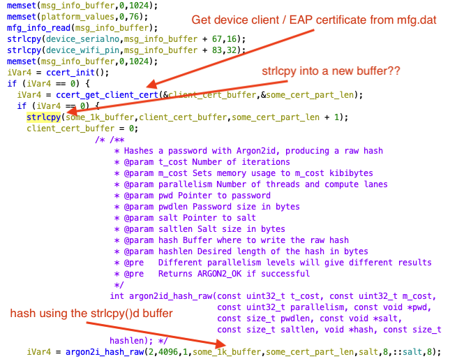
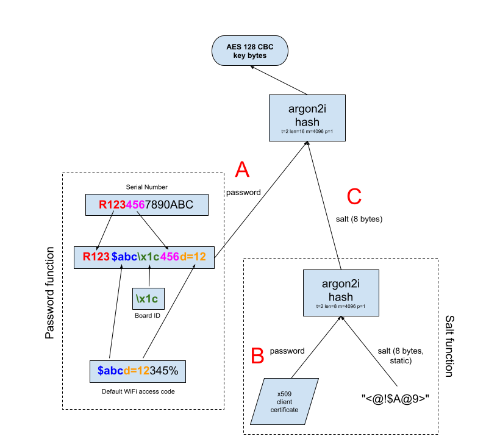
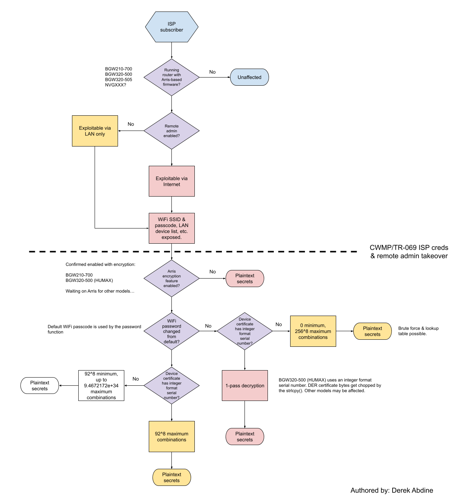
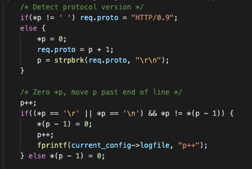
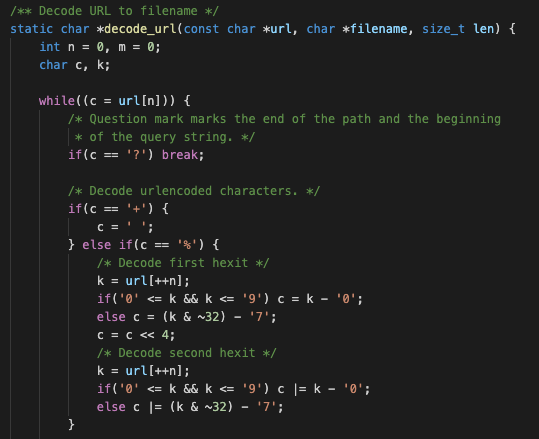

# Arris / Arris-variant DSL/Fiber router critical vulnerability exposure

**NOTE: This issue has been patched and deployed by at least one ISP, whose BGW routers use a customized variant of Arris NVG firmware.**

Multiple vulnerabilities exist in the MIT-licensed [muhttpd web server](http://inglorion.net/software/muhttpd/). This web server is widely used in ISP customer premise equipment (CPE), most notably in Arris firmware used in router models (at least, possibly other) NVG443, NVG599, NVG589, NVG510, as well as ISP-customized variants such as BGW210 and BGW320 (Arris has declined to confirm affected models). These routers are typically loaned to ISP subscribers for telephony and Internet access. The most severe vulnerability allows unauthenticated path traversal from the root of the file system as the root user. It is possible to recover the WiFi access code and SSID, remote administration password, SIP credentials (if VoIP is supported), ISP CWMP/TR-069 endpoint URLs and their username and password as well as other sensitive information, although some parts may require more complicated techniques or computing resources that may not be available to all attackers. Network-based unauthenticated exploitation is most severe if the router’s web services (such as the administration portal) are exposed to the Internet, though it can also be exploited on the LAN. According to Censys (link redacted to limit targeting), **there are at least 19,000 Internet-facing likely vulnerable routers exposed directly to the Internet (at the time of writing, though patching since private disclosure has greatly reduced this number)** over US, European and APAC ISPs, impacting both residential and business clients. There are millions more that are not Internet-facing or not easily identifiable from the Internet (depending on aggregate ISP deployment footprint).

Prior to the patch in version 1.1.7 (released June 1st, 2022), muhttpd was last released in 2010 (version 1.1.5), and the path traversal issue appears present in the initial commit of the muhttpd source in 2006. Additionally, the vulnerability appears to be present in the earliest versions of the Arris firmware (or any firmware that forks the Arris firmware). Testing confirms presence in at least version 2.7.7 (2020) in a BGW210-700 gateway. Thus, it should be assumed information and access detailed in this report was obtainable for at least several years, if not from the first launch of all NVG/BGW products.

A working proof-of-concept exploit exists that can do the following without authentication:
- Download any non-directory, non-special file from the device.
- Loot secrets from the device database through `/etc/config.cfg`, including every WiFi SSID broadcast by the device and their corresponding access codes, management passwords, the device pin, and CWMP endpoint and credential information** (some router models may encrypt portions of this information, though the encryption implementation is flawed–see below).
- Deobfuscate any file in the proprietary “XMLC” file format (the device config database “`/etc/config.cfg`” is in this format, as well as the web server private key)
- Enumerate all processes, their environment variables and command line arguments.
- Parse the `mfg.dat/calibration_01.bin` file to extract secrets such as the default access code and pin (this file can be obtained by using the file download functionality of the exploit while the router is booting by repeatedly requesting the file as it is temporarily mounted during boot).

Additionally, another proof-of-concept decryption tool exists that can decrypt any base64-encoded device secret from the deobfuscated `/etc/config.cfg` if given a device serial number, default WiFi access code, “board id” and certificate (all of which are obtainable via the Internet, except for the certificate – see “decrypting secrets” below).

Neither proof of concept will be released to the public.

## Disclosure timeline
April 6th, 2022: Initial disclosure to Arris\
April 9th, 2022: Initial submission to CERT/CC for coordination with other affected ISPs\
April 11th, 2022: Response from CERT/CC\
April 14th, 2022: Response from Arris from initial report received\
April 25th, 2022: Arris confirms the path traversal vulnerability\
April 26th, 2022: Disclosure to an affected ISP\
May 4th, 2022: Patches roll out to aforementioned affected ISP subscribers\
May 9th, 2022: Arris confirms a patch has been created for the path traversal and URL decoder vulnerabilities\
May 10th, 2022: Aforementioned ISP formally confirms fix\
May 27th, 2022: Moved disclosure date to June 30th from June 6th.\
May 27th, 2022: Assigned CVE-2022-31793 to vulnerability #1\
May 28th, 2022: Notified original developer of muhttpd of vulnerability details\
May 30th, 2022: Original muhttpd developer crafts patch and awaits disclosure\
June 8th, 2022: No updates in CERT case. Reached out to 3 additional additional ISPs via linkedin (no public contact information available). Received one response (ISP “B”).\
June 13th, 2022: ISP “B” is given full disclosure details.\
June 22nd, 2022: ISP “B” acknowledges receipt, no further questions or extension request.\
June 29th, 2022: Publish date moved to July 29th, 2022 to allow more ISPs to deploy patches.\
July 29th, 2022: Public disclosure

## Vulnerability 1 (CVE-2022-31793): Path traversal from the filesystem root

**Mitigation: Stop the web server, or firewall it from untrusted networks (Internet, LAN). For affected Arris-based gateways: Disable remote management, or firewall the remote access ports from the Internet. This does not stop LAN (Ethernet or WiFi) exploitation, however. For regular users of muhttpd: Upgrade to version 1.1.7.**

The muhttpd server 1.1.5 (last official release 2010) has a path traversal vulnerability. Exploitation is trivial: Simply prepending a single character (or hexit such as `%0a`, with the exception of `%00` as it is a NUL byte) that is not a dot (“`.`”), forward slash (“`/`”) or question mark (“`?`”) before the requested path is sufficient to obtain any regular file on the device (the server does restrict directory listing and special file – such as symlinks and block devices – access):

```bash
curl --ignore-content-length -X"GET a/etc/hosts" http://<ip>:<port>
```

The above command will cause curl to issue a “`GET a/etc/hosts / HTTP/1.0`” request to the remote endpoint. The muhttpd server will happily ignore the extra “`/`“ prior to the HTTP protocol in the request. In fact, the exploit can be simplified to (plaintext HTTP):

```bash
printf "GET a/etc/hosts\n\n" | nc server port
```

To test this on a suspected vulnerable device over the LAN, assuming the gateway IP is 192.168.1.254:

```bash
printf "GET a/etc/hosts\n\n" | nc 192.168.1.254 80
```

The root cause of this issue is fairly straightforward: The server references the path component of the URL using the C code `&filename[1]`, which effectively skips over the first letter (a/etc/hosts becomes `/etc/hosts`). No checks are done prior to handling the request to jail any paths under the web root (the server process is simply chdir()’d into the web root), although the path is sanitized before it gets to this point to strip out “`../`” sequences:

```c
	/* Open file */
	fd = open(&req->filename[1], O_RDONLY);
	if(fd < 0) {
		/* open failed, inform client */
		if(req->status != HTTP_200) {
			/* Unable to send error document; send error message */
			send_status_message(req);
```

### Practical exploitation for millions of routers
For any router using an Arris-based firmware containing this web server, an unauthenticated remote (if remote administration is enabled) or local (LAN) party can obtain:
- **The contents of the md5crypt (salted/hashed) passwords in /etc/passwd**, which can be passed to password cracking rigs to identify the administrator password to change configuration settings on the device. The “`remote`” account corresponds to the remote management password (remote administration).
- Via the device “sdb” database file located at `/etc/config.cfg` (requires extra steps, see the sections on deobfuscation and decryption below):
    - **The SSID and plaintext password of the 2G and 5G WiFi networks** broadcast by the device, and their independent on/off states.
    - **The usernames and (sometimes encrypted) passwords of all administration accounts on the system.** Several accounts (administrator, dslf-config) have passwords set to the device pin (printed on a sticker on the device itself).
    - **ISP TR-069 / CWMP ACS and CR configuration information, including CWMP endpoint URLs, logging urls and their usernames and passwords** (sometimes encrypted), per subscriber (unknown if any are shared).
    - **SIP usernames (phone numbers) and passwords, including SIP endpoint URLs**.
    - **Port forwarding configuration information, including the external port, internal port and mac address** of the device which has a port forward configuration. When combined with the LAN device list, it can enable more sophisticated targeting.
- Sensitive network information, such as established TCP connections and the router’s ARP table and various MAC addresses, via the proc filesystem. **The MAC address of the wireless networks (BSSID) can be used to geolocate these routers via wigle.net.**
- **Various system & firewall logs**, such as `/var/log/system.log.1`, `/var/log/firewall.log`, etc.
- **A complete list of the LAN IP address, hostname, MAC, uptime, and device characteristics such as the operating system and known applications of every device on the LAN** via several files on the router (`/var/tmp/cwmp.lhd`, `/var/etc/hostdb.gz`, …)
- **The router serial number** (via `/sys/motopia/serial_number`, `/etc/hosts` and elsewhere) and model number (via `/sys/motopia/dsl_eoc_string`, though this does not appear to be on BGW320 devices) of the device.
- The **certificate and private key** for the web management portal (requires deobfuscation, same as `/etc/config.cfg*`) and internal web services the device uses.
- **Router process information can be brute forced by walking the proc filesystem** (`/proc/<pid>/...`), including obtaining each process executable, its command line, its environment, etc. Process memory cannot be retrieved since the code that sends the byte stream of file data does not support range requests, and reading from the address 0x0 is not allowed.

A non-exhaustive list of example attack scenarios:
- An actor scans the internet for vulnerable devices, downloads the device configuration database (`/etc/config.cfg` files) and deobfuscates them using the proof-of-concept. The actor then grabs the management password for each endpoint from the deobfuscated configuration file, logs into the router web admin portal over the Internet and reconfigures the network.
- An actor uses the above method to grab CWMP credentials and attempts to [reconfigure a subscriber’s router configuration](https://www.pcworld.com/article/440767/many-home-routers-supplied-by-isps-can-be-compromised-en-masse-researchers-say.html) via the ISP.
- In the case the management password is obtained, it would be possible to surreptitiously add port forwarding rules and additional WiFi network configurations for some level of persistence into the network. For example:
    - An attacker could expose a LAN device to the Internet over its Remote Desktop Protocol (RDP) port, then run a secondary exploit/credential stuffing attacks on that host.
    - An attacker could expose a database server’s port to the Internet and potentially leverage a misconfiguration / LAN trust relationship to download / retrieve data.
- A semi-sophisticated actor may choose to identify vulnerable devices of interest for a victim corporation, government or critical infrastructure provider. They would:
    1. Enumerate all LAN devices, router serial numbers, WiFi SSIDs, BSSIDs and passwords from every device exposed to the Internet (roughly 19K exposed).
    2. Filter / select which targets based on certain criteria, such as corporate device asset hostname naming patterns, physical location (proximity to the attacker), types of applications on the network (Tesla vehicles use their model name as their hostname, and some devices such as Tesla Powerwalls have been [known to use their hostname as their password](https://www.forbes.com/sites/thomasbrewster/2020/11/17/hundreds-of-tesla-powerwalls-exposed-to-potential-password-hacks-via-google---dont-let-one-be-yours), etc.
    3. Geolocate those devices using the BSSID of the router (obtainable through the proc filesystem) and wigle.net.
    4. Physically visit the location of the router, authenticate to the device wirelessly using credentials from the configuration database obtained via exploitation, and launch further attacks on LAN devices.

### File obfuscation and the device configuration database
Certain files on Arris-based routers, such as dropbear and HTTPS RSA keys (for the web portal and other HTTP-based services), SKU-specific configuration files, and the contents of `/etc/config.cfg` (the device configuration database) appear to be in a proprietary binary data format, with an “XMLC” header. Binwalk indicates these files have fairly high entropy, indicating obfuscation, compression or encryption:

<p align="center">
<br/>
<i>results of `binwalk -E on /etc/config.cfg` – entropy is extremely 
high indicating the file is obfuscated or encrypted.</i>
</p>

However, the HTTPS private key is read by muhttpd, and reading a private key and certificate has existed in the original source code for SSL/TLS support, while the original source does not support this file format. As it would turn out, **the modified/customized muhttpd binary shipping in the firmware of these routers has the ability to deobfuscate files from this proprietary format**. More specifically, the `ssl-key` parameter in the muhttpd server configuration file references the private key that must be in this format. After deobfuscating, the binary will pipe the data to `/bin/gzip` to deflate the contents to their plaintext form, then pipe the output of gzip back into its own process to set the server key:

<p align="center">
<br/>
<i>Normal flow for reading the https.key (obfuscated in proprietary XMLC format) for the Arris-customized muhttpd</i>
</p>

This chain of custody issue (using an untrusted external program, `/bin/gzip`) can be exploited to avoid reverse engineering the proprietary file format. Thus, to restore any file in this format back to its original content, **you can deobfuscate it in a docker container by abusing the `/bin/gzip` relationship with muhttpd**:
1. Download the necessary executable binaries and libraries from the device (muhttpd and its required libraries in `/lib`)
2. Download the target file encoded in this format (https keys, `/etc/config.cfg`, etc.)
Create a fake httpd.conf file with its `ssl-key` parameter set to the XMLC filename we want to decode.
3. Create a fake `/bin/gzip` with a small script (chmod +x) that copies `/dev/stdin` to a resulting file on the mounted docker volume:\
   `cp /dev/stdin /some/volume/mounted/to/host/output.gz`
4. Set necessary file permissions, volume mounts (for the libs, muhttpd binary, fake gzip and httpd.conf file) and execute muhttpd in the container.

<p align="center">
<br/>
<i>Abusive flow for deobfuscating any file in the proprietary XMLC file format</i>
</p>

The muhttpd server will fail to launch if the result of deobfuscating the input file is not an RSA key. However, that doesn't matter since it would've already piped the contents to (a fake) `/bin/gzip`. The point of the container is only to get to that point, not run a functional muhttpd server (though that is indeed possible with a bit of work). The result is a completely deobfuscated version of the input XMLC file. Note that non-XML files are encoded in this format (RSA private keys). The letters “XML” in “XMLC” seem to bear no relationship to the deobfuscated content (i.e., don’t always expect the content to be XML once deobfuscated). The deobfuscated content itself is gzipped, so you must decompress it first (technically, we could’ve piped it to the real `/bin/gzip` before writing output.gz).

A proof-of-concept exists that has the ability to deobfuscate `/etc/config.cfg` (the device database) and other files in the XMLC file format using the above method (assuming docker and a few python libraries are installed). A deobfuscated `/etc/config.cfg` would look something like this (heavily truncated/redacted and will differ based on the router model, firmware and ISP), versus the binary blob of data you would otherwise see without deobfuscating:

```xml
<?xml version="1.0" encoding="UTF-8"?>
<config>
   <cgn>
      <MaxTCPInternalPortsUsed>1377</MaxTCPInternalPortsUsed>
      <MaxTCPUserPortsUsed>5528</MaxTCPUserPortsUsed>
      <MaxUDPInternalPortsUsed>3993</MaxUDPInternalPortsUsed>
      <MaxUDPUserPortsUsed>592</MaxUDPUserPortsUsed>
      <MaxOtherInternalPortsUsed>1</MaxOtherInternalPortsUsed>
      <MaxOtherUserPortsUsed>84</MaxOtherUserPortsUsed>
   </cgn>
   <tai>
      <config>
         <enable-v-zone-ad notify="active" setby="4">on</enable-v-zone-ad>
         <carousel-ip-addr notify="active" setby="4"><<REDACTED>></carousel-ip-addr>
         <carousel-port notify="none" setby="4"><<REDACTED>></carousel-port>
         <key-identification-counter notify="none" setby="4">19</key-identification-counter>
         <authentication-key notify="none" setby="4"><<REDACTED>></authentication-key>
      </config>
   </tai>
   <system>
      <timezone notify="none" setby="4">PST8PDT</timezone>
<< CUT >>
      <microservice>
         <execution-environment name=" ">
            <status>Up</status>
            <upgrade-status>off</upgrade-status>
            <registry-password><<REDACTED, ENCRYPTED>></registry-password>
            <manifest-server-password><<REDACTED, ENCRYPTED>></manifest-server-password>
            <registry-pswd-flag>on-1</registry-pswd-flag>
            <manifest-server-pswd-flag>on-1</manifest-server-pswd-flag>
            <reboot-status>off</reboot-status>
         </execution-environment>
<< CUT >>
      <cwmp>
         <acs-url notify="active" setby="4"><<REDACTED>></acs-url>
         <acs-password notify="active"><<REDACTED, ENCRYPTED>></acs-password>
         <acs-pwd-flag>on-1</acs-pwd-flag>
         <cr-url notify="active">/XML/001E46-<<REDACTED>>.xml</cr-url>
         <cr-username notify="active" setby="4">001E46-<<REDACTED>></cr-username>
         <cr-password notify="active" setby="4"><<REDACTED, ENCRYPTED>></cr-password>
         <cr-pwd-flag setby="4">on-2</cr-pwd-flag>
         <param-key setby="4">1</param-key>
         <periodic-inform>
            <enable notify="none" setby="4">on</enable>
            <interval notify="none" setby="4">86400</interval>
            <time setby="4">2021-11-08T04:00:00Z</time>
         </periodic-inform>
         <sbdc>
            <enable notify="none">on</enable>
            <request-port>61001</request-port>
            <request-url>001E46_<<REDACTED>></request-url>
            <ssl-enable>on</ssl-enable>
            <max-sessions>8</max-sessions>
<< CUT >>
   <phy>
      <enet name="wan" id="7">
         <port id="7">
            <media-type>copper</media-type>
         </port>
      </enet>
      <wl80211 id="1" version="1.0">
         <enable>on</enable>
         <radio notify="active">on</radio>
         <ssid id="1" version="1.0">
            <enable notify="active">on</enable>
            <ssid-name notify="active">homenet</ssid-name>
            <passphrase notify="active">hunter2!</passphrase>
         </ssid>
         <ssid id="2" version="1.0">
            <enable notify="active">off</enable>
            <ssid-name notify="active" setby="4"><<REDACTED>>_Guest</ssid-name>
            <passphrase notify="active">test123!</passphrase>
            <admin-access-enable>off</admin-access-enable>
            <wired-access-enable>off</wired-access-enable>
         </ssid>

<< CUT >>
   <voice>
      <profile id="1">
         <sip-publish-invocation setby="4">endofcall</sip-publish-invocation>
         <sip-advanced-setting>
            <sip-digit-map notify="none" setby="4">O=15,I=6,S=3(*#101&lt;:@C03&gt;|*#103&lt;:@C06&gt;|T0|T*xx|T*xxx|[2-9]11|[01]911|988|1[2-9]xxxxxxxxx|T[2-9]xxxxxx|[2-9]xxxxxxxxx|n.)</sip-digit-map>
            <sip-allow-ip-list setby="4"><<REDACTED>></sip-allow-ip-list>
         </sip-advanced-setting>
         <user-account name="1" id="1">
            <enable notify="none" setby="4">off</enable>
            <sip-user-password/>
            <sip-user-password-flag>off</sip-user-password-flag>
         </user-account>
         <user-account name="2" id="2">
            <sip-user-password/>
            <sip-user-password-flag>off</sip-user-password-flag>
         </user-account>
         <user-account name="3" id="3">
            <sip-user-password/>
            <sip-user-password-flag>off</sip-user-password-flag>
         </user-account>
         <user-account name="4" id="4">
            <sip-user-password/>
            <sip-user-password-flag>off</sip-user-password-flag>
         </user-account>
      </profile>
```

<p align="center">
<i>An example of the contents of a deobfuscated `/etc/config.cfg` from a BGW router. The microservice environment appears to be a docker environment for running speed test software. Note that this specific router did not have VoIP enabled, so no SIP passwords are present in this instance.</i>
</p>

### Decrypting secrets
The firmware may encrypt plaintext secrets in the `/etc/config.cfg` file (see “REDACTED, ENCRYPTED” markers above) using AES-128-CBC (default padding). The AES ciphertext is encoded using base64 before writing to the configuration database (`/etc/config.cfg`), which itself is obfuscated using a proprietary “XMLC” file format (see below on deobfuscation). However, the encryption is particularly weak due to a number of issues and is susceptible to fixed-value, brute force or lookup table attacks.

**Given a base64-encoded ciphertext, is it possible to recover the plaintext?** Let’s assess.

The AES 16-byte (128 bit) key is derived from two invocations of Argon2i, a modern hashing algorithm. In both phases, Argon2 is run with a t_cost of 2, memory of 4096KiB, and parallelism of 1. First, an 8-byte key salt is computed by the firmware. This salt is created by utilizing the byte stream of a DER-encoded client certificate embedded in the device at manufacture time as the password, while using a fixed 8-byte string as the salt. However, interestingly, the code copies the certificate DER byte array to a separate buffer using strlcpy() before hashing with Argon2i. **Use of `strlcpy()` effectively arbitrarily chops the client certificate bytes to the first NUL terminator encountered in the DER certificate byte array** (as the `str*cpy` functions operate on strings and consider a NUL `\x00` to be the end of a string), greatly reducing or eliminating the entropy used in the hash function:

<p align="center">

</p>

Interestingly, this defect is similar to the [strcmp issue](https://wiibrew.org/wiki/Signing_bug) that enabled the Nintendo home brew scene, and points to a misunderstanding of the source data being used, or the effect of string operations on non-string data. The key salt is then fed into Argon2i again (this time with a hashlen of 16 bytes, corresponding to the 128-bit AES key length), with the password in this second invocation set to a computed string based on the default WiFi access code, the device serial number, and board id:

<p align="center">

</p>

Given vulnerability #1, the device serial number, wifi access code, and board ID are known. The serial number is obtainable in a number of places, such as `/sys/motopia/serial_number`, `/etc/hosts`, and various log files. The WiFi access code can be obtained through `/etc/config.cfg` (once deobfuscated, see below) unless customized by a user, or it can be viewed in plaintext in the management user interface (if the user has the access pin, which is printed on the device). The board ID is a single byte value which is printed in `/var/log/system.log{,.1,.2}` (also obtainable with the same vulnerability), and appears to be a simple, short enumeration (BGW210 devices use `0x1c`, BGW320 devices use 0x1e or 0x1f depending on the manufacturer). Thus, the password “A” is assumed to be completely known.

**Knowledge of “A” (through information easily obtained over the network via the muhttpd vulnerability) in effect renders the 128-bit AES encryption to 64 bits (the same as the salt “C”).**

Thus, we are left with a few methods of obtaining the salt value “C” to recover the AES key and decrypt any secrets encrypted using this key generation methodology:
- **Obtaining the certificate via reboot & exploitation.** This is less interesting, because a reboot would require social engineering or physical access. The certificate can be obtained via a router reboot, while repeatedly requesting the /mfg/mfg.dat file on BGW210-700 models using vulnerability #1 (or /mfg/calibration_01.bin on BGW320-500 models). The client, intermediate and root certificates as well as the private key exist at offset -16384 (that is, from the end of the file) of mfg.dat. This file is mounted temporarily during bootup and after the muhttpd server is online, but it appears it is unmounted prior to the WAN interface going live.
- **Brute-forcing 2^64 possible values of the salt.** With the right hardware it may be possible to brute force the correct value for C by trying all 2^64 or 1.844674407x109 combinations of values. The required computational power for this likely makes it impractical for the casual attacker except for a select few organizations (possibly state-aligned) with the requisite compute power.
- **Exploiting the strlcpy() call and certificate DER encoding properties.** A BGW320-500 manufactured by HUMAX was found to use a serial number in a small enough integer such that the DER bytes in the certificate contained a NUL byte in a fixed location. For devices with client certificates installed at manufacture time which use a serial number stored this way, it is possible to use a fixed set of bytes as a placeholder for the entire certificate, nullifying the entropy otherwise incorporated into the key. This was verified on another similar device using a proof of concept decrypt tool:

```bash
decrypt <MODEL NUMBER> \
        <WIFI PASSCODE> \
        <BOARD ID> \
        "$(python -c 'import base64;print(base64.b64encode(bytes.fromhex("308203d5308202bda0030201020209" + "0" * 1940)).decode("utf-8"))')" \
        <ENCRYPTED SECRET>
```

The 15-byte sequence “`308203d5308202bda0030201020209`” is straight from a HUMAX-generated certificate on a BGW320-500 gateway, and starts with a DER SEQUENCE (3082) tag (length 981 - `03d5`). The remaining 1940 characters are zeros, corresponding to the NUL-padded (due to the `strlcpy()`) byte array fed into the argon2i hash function (the full size of the buffer is still used). We can check our math: 1940/2 (hex digits) is 970, and the 15-byte header gives us a total size of 985, the on-disk size of the client certificate (subtract 4 bytes for the initial sequence tag header, and you’re left with 981).

In the event the serial number is not stored in this format, the NUL may come in a different position with some entropy offered by the bytes comprising the certificate (up until a NUL byte is encountered). However, in this case, the entire amount of entropy incorporated into the hash depends on the entropy used to source the serial number, as it is the first non-fixed field in the certificate after the initial sequence tag. If the serial number is found to be generated in a predictable way – such as sequential/incremental generator – it would be possible to compute a lookup table in a very reasonable amount of space to “recover” the appropriate certificate material and bypass encryption no matter the length of the bytes representing the serial number. This could be proven by obtaining certificates from several devices by the same manufacturer and comparing their serial numbers. Otherwise, one may choose to use precomputed lookup tables that search for a NUL in the first 5-6 bytes of the certificate, and resort to brute forcing methods within reasonable limits depending on available computing resources (however, at a certain point it may make more sense to just brute force the 8-byte salt itself). 

*A special thanks to Royce Williams (twitter: [@TychoTithonus](https://twitter.com/TychoTithonus)) and Sam “Chick3nman” Croley (twitter: [@Chick3nman512](https://twitter.com/Chick3nman512)) of the Hashcat team for their advice during analysis.*

Thus, the answer is yes: **It is possible to recover the plaintext remote administration password and pin for the device, as well as the SIP and ISP CWMP passwords used for the particular customer over the Internet if they are encrypted**, though with varying degrees of difficulty, as depicted by this chart:

<p align="center">
<br/>
</p>


It’s worth noting that if the certificate is known by anyone other than the ISP or the subscriber, the LAN should be assumed compromised as well. If the client certificate is shared with the ISP, the ISP would also have control over the remote administration password, WiFi access code, etc. (however, some of this information, like the WiFi access code, is already shared with certain ISPs in their cloud portals). In remote work scenarios where the ISP holds this information, an organization’s attack surface includes the ISP of the home user. Subscribers should act as if the LAN is tainted if the web administration portal is Internet-facing anyway, as the plaintext WiFi password is obtainable by downloading and deobfuscating /etc/config.cfg, which is trivial. Changing the WiFi password is also recommended.

## Vulnerability 2: NULL pointer dereference
**Mitigation: Disable remote access, or firewall the remote access ports from the Internet.\
Note: No CVE was filed for this issue.**

The muhttpd server receives HTTP requests on a non-blocking socket. Socket connections are accept()ed and fed to a `fork()`ed process to execute. When data is received, the server reads in a loop until a sequence of two carriage return/newline characters are received (`read_request`). Processing is then handed off to another method (`do_request`) which attempts to parse the request method, uri, filename, and headers.

Injecting a NULL byte into the request steam will cause the request process (forked from the server process) to segfault:

http:
```bash
echo -n "GET a \x00\n\n" | nc serverip 80
```
OR (due to echo compatibility between shells/environments)
```bash
echo 474554206120000a0a | xxd -r -p | nc 192.168.1.254 80
```

https:
```bash
(echo -n "GET a \x00\n\n"; cat) | openssl s_client -host serverip -port 443
```
OR
```bash
(echo 474554206120000a0a | xxd -r -p; cat) | openssl s_client -host serverip -port 443
```

This problem manifests when parsing the request protocol (`HTTP/1.0`, for example) in `request.c#do_request`. The call to `strpbrk` can return NULL if the string terminates before a token is found, which would be the case if a NUL byte is injected into the request stream sent to the server. The end result is a NULL value for p, followed by an increment to address `0x00000001` and a dereference of p to check for ‘`\r`’ or ‘`\n`’, which causes the segfault:

<p align="center">
<br/>
</p>

However, various other parts of the request processing code are also prone to the same issue. The request processing code of this server should be revisited to ensure processing robustness, and tested against several edge cases such as this.

Functionally the child `fork()`ed process crashes, but because of the fork, the main server continues to listen and accept sockets. Therefore, no DoS-like attacks are likely using this scenario, though resource exhaustion leading to DoS may be possible with more research.

## Vulnerability 3: Buffer over-read when defanging URLs
**Mitigation: Disable remote access, or firewall the remote access ports from the Internet.\
Note: No CVE was filed for this issue.**

The muhttpd server contains a buffer over-read when dealing with percent-encoded values, such as `%2e` (dot). When encountering a percent “`%`” in the URL, the server attempts to decode the next two characters without checking the bounds, and while incrementing the index “`n`” into the URL buffer “`url`.” The end result is that if the URL consists of “%” with no following characters, the decode_url function will read past the URL data and into the parts of the request buffer containing the HTTP protocol version string (`HTTP/1.0`, `HTTP/1.1`, etc.), as the code previously had parsed the input request stream from the client by injecting NUL terminators in the original socket data as opposed to allocating new buffers. While not practically exploitable, safeguards should be made to prevent accessing unintended address space. The worst an attacker could do with this issue–when combined with vulnerability 1–is single-level path traversal (`../`). However, since vulnerability #1 is much more severe as it allows traversal from the filesystem root, and since fixing vulnerability #1 would also fix this traversal problem, addressing vulnerability #1 is enough to mitigate the path traversal issue here (but not completely eliminate the over-read).

<p align="center">
<br/>
</p>


## Conclusion
Arris and Arris firmware-based devices have a web administration portal running muhttpd which has three vulnerabilities, one of which is critical, and two of which are presumably impractical to exploit. The affected server is used in fiber and DSL-based Arris router products (NVG), as well as whitelabel/OEM products (BGW) by other vendors. The complete list of affected products is unknown as Arris has declined to comment on the affected product list.

Internet Service Providers (ISPs) around the world typically loan these routers out to their collective millions of subscribers, though only up to 19,000 have been visible on the public Internet. Since the firmware is widespread and every ISP manages their own firmware updates independently, it’s likely that this issue will persist for years. While the majority of devices disclosed in this advisory through public searches are now patched, it is unlikely the search contains every exposed device, due to per-ISP filtering, transient network errors from Internet scanning engines, and differences in fingerprinting methodologies that the search query may have missed.

Though no evidence of active exploitation exists, it is best to create an action plan that assumes a subscriber (residential or commercial) has been compromised due to the length of time the vulnerability has existed. Subscribers can mitigate any potential *future* impact by limiting access to the administration portal (typically at http(s)://192.168.1.254/) on the LAN and WAN (e.g., by placing untrusted guests on a separate guest network without the administration portal exposed, and by disabling the ability to access the portal from the Internet).


